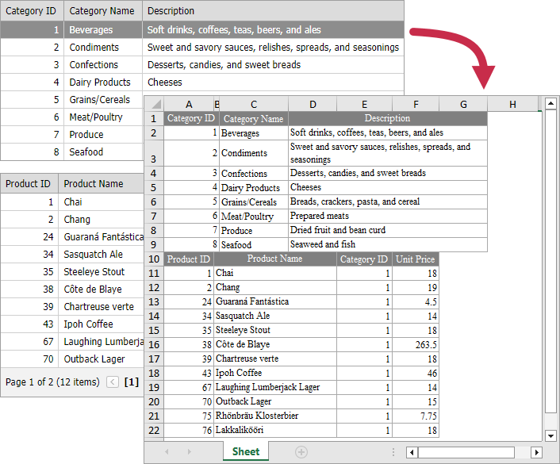

<!-- default badges list -->

[](https://supportcenter.devexpress.com/ticket/details/E3891)
[](https://docs.devexpress.com/GeneralInformation/403183)
<!-- default badges end -->

# Grid View for MVC - How to export multiple grids into a single print document
<!-- run online -->
**[[Run Online]](https://codecentral.devexpress.com/128551526/)**
<!-- run online end -->

This example shows how to use the XtraPrinting library to export several MVC [GridView](https://docs.devexpress.com/AspNetMvc/8966/components/grid-view) Extensions into a single XLS document.



You can export several grids into a single document in the following way:

1. Create a [PrintableComponentLinkBase](https://docs.devexpress.com/CoreLibraries/DevExpress.XtraPrintingLinks.PrintableComponentLinkBase) object for every grid. Call the [GridViewExtension.CreatePrintableObject](https://docs.devexpress.com/AspNetMvc/DevExpress.Web.Mvc.GridViewExtension.CreatePrintableObject(DevExpress.Web.Mvc.GridViewSettings-System.Object)) method to create an IPrintable object from the GridView based on its [GridViewSettings](https://docs.devexpress.com/AspNetMvc/DevExpress.Web.Mvc.GridViewSettings).

    ```cs
    GridViewSettings categoriesGridSettings = new GridViewSettings();
    categoriesGridSettings.Name = "gvCategories";
    categoriesGridSettings.KeyFieldName = "CategoryID";
    categoriesGridSettings.Columns.Add("CategoryID");
    categoriesGridSettings.Columns.Add("CategoryName");
    categoriesGridSettings.Columns.Add("Description");

    var link1 = new PrintableComponentLinkBase(ps);
    link1.Component = GridViewExtension.CreatePrintableObject(categoriesGridSettings, MyModel.GetCategories());
    ```

2. Call the [CreateDocument](https://docs.devexpress.com/WPF/DevExpress.Xpf.Printing.LinkBase.CreateDocument) method to create a document from the link, so it can be displayed or printed.

    ```cs
    var compositeLink = new CompositeLinkBase(ps);
    compositeLink.Links.AddRange(new object[] { link1, link2 });
    compositeLink.CreateDocument();
    ```

3. Call the [PrintingSystemBase.ExportToXls](https://docs.devexpress.com/CoreLibraries/DevExpress.XtraPrinting.PrintingSystemBase.ExportToXlsx(System.IO.Stream)) method to export the document.

    ```cs
    MemoryStream stream = new MemoryStream();
    link.PrintingSystemBase.ExportToXls(stream);
    stream.Position = 0;
    FileStreamResult result = new FileStreamResult(stream, "application/xls");
    result.FileDownloadName = "MyData.xls";
    ```

## Files to Review

* [HomeController.cs](./CS/Controllers/HomeController.cs) (VB: [HomeController.vb](./VB/Controllers/HomeController.vb))
* [Model.cs](./CS/Models/Model.cs) (VB: [Model.vb](./VB/Models/Model.vb))
* [GridViewPartialCategories.cshtml](./CS/Views/Home/GridViewPartialCategories.cshtml)
* [GridViewPartialProducts.cshtml](./CS/Views/Home/GridViewPartialProducts.cshtml)
* [Index.cshtml](./CS/Views/Home/Index.cshtml)


## More Examples

* [How to Show Detail Information in a Separate Grid](https://github.com/DevExpress-Examples/aspxgridview-show-detail-information-in-separate-grid)
* [How to combine a number of ASPxGridView documents in one when exporting](https://github.com/DevExpress-Examples/how-to-combine-a-number-of-aspxgridview-documents-in-one-when-exporting-e1535)
